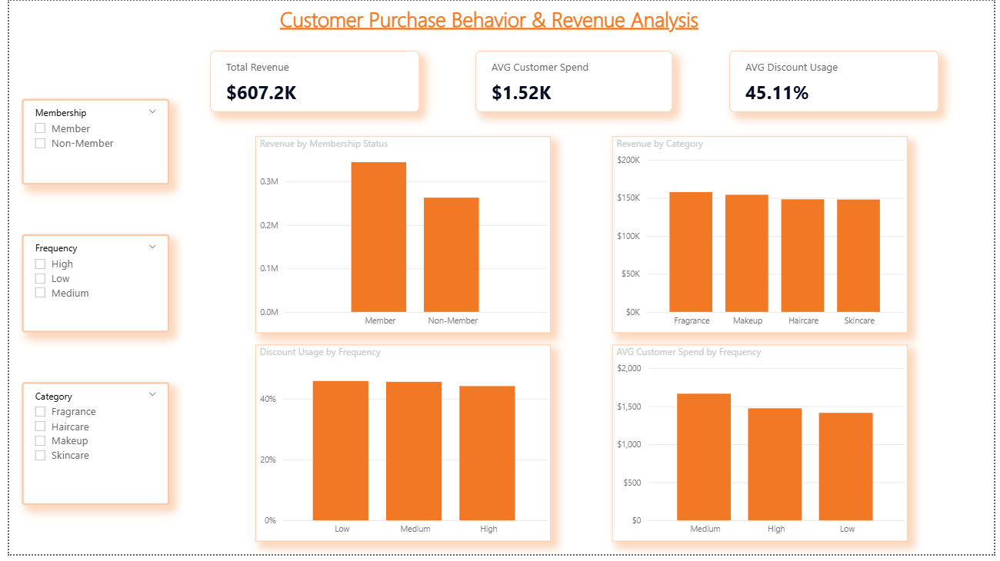

# 📊 Fashion & Retail Customer Analysis

## Dashboard Preview

## 📌 Project Overview
This project explores customer purchase behavior, spending patterns, and discount usage within a simulated fashion & retail dataset. The goal was to replicate a real-world data analyst workflow by combining Excel, SQL, and Power BI to generate actionable business insights.

---

## 🛠 Tools Used
- Excel (Data Exploration & Pivot Analysis)
- SQL (SQLite)
- Power BI (Dashboard & Data Visualization)

---

## 📈 Business Questions Explored
- What is the total revenue generated?
- Do members spend more than non-members?
- Which product categories drive the most revenue?
- How does purchase frequency impact customer spend?
- How do discounts influence purchasing behavior?
- Which customer segments are most valuable?

---

## 💰 Key Metrics Analyzed
- Total Revenue
- Average Customer Spend
- Discount Usage Rate
- Revenue by Category
- Revenue by Membership Status
- Customer Spend by Purchase Frequency

---

## 🔎 SQL Analysis
SQL queries were used to calculate KPIs and evaluate customer behavior patterns, including:

- Revenue Aggregations
- Customer Segmentation
- Discount Behavior Analysis
- Category Performance
- Top Customer Identification

All SQL queries are available in:

`fashion_retail_analysis.sql`

---

## 📊 Dashboard Insights
Power BI was used to build an interactive dashboard visualizing:

- Revenue Distribution
- Customer Spending Trends
- Discount Utilization
- Membership Performance
- Behavioral Segmentation

---

## 🚀 Key Insights
- Members generate higher overall revenue compared to non-members
- Medium-frequency customers show the highest average spend
- Discount usage remains consistent across frequency segments
- Revenue is distributed relatively evenly across product categories
- Customer behavior patterns reveal distinct value segments

---

## 📁 Repository Contents
- `fashion_retail_customers.csv` → Dataset
- `fashion_retail_analysis.sql` → SQL Queries
- `Customer_Purchase_Behavior.pbix` → Power BI Dashboard
- `powerbi_dashboard.png` → Dashboard Screenshot

---

## ✅ Project Outcome
This project demonstrates end-to-end data analysis skills including data exploration, KPI calculation, SQL querying, and dashboard development. The workflow mirrors real-world analyst responsibilities involving business metric evaluation, customer segmentation, and performance reporting.

## Project Workflow

1. Explored customer transaction data in Excel to understand purchase patterns.
2. Used SQL queries to analyze spending behavior, category performance, and discount usage.
3. Loaded the dataset into Power BI for visualization.
4. Created DAX measures to calculate key retail metrics.
5. Built an interactive dashboard to analyze customer purchasing trends.
